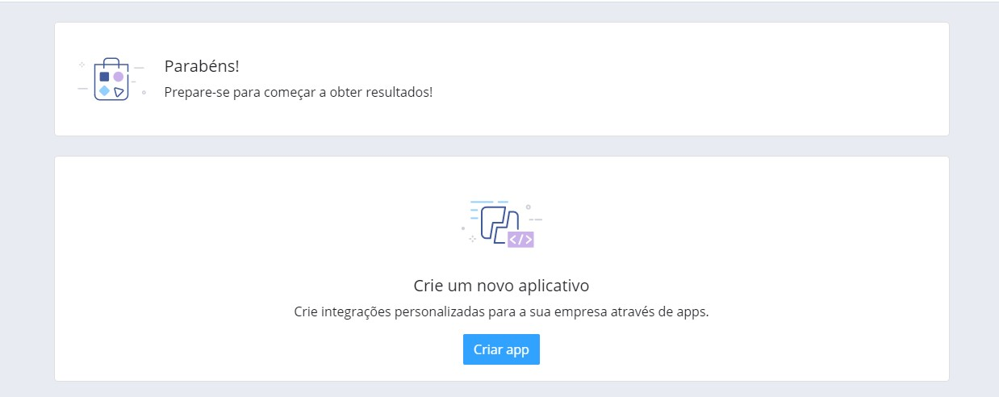
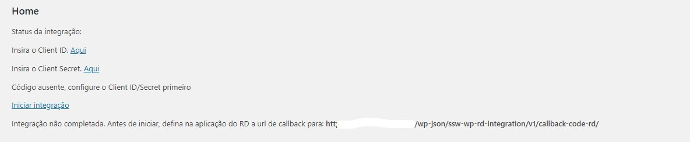
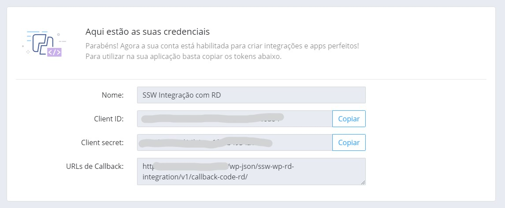
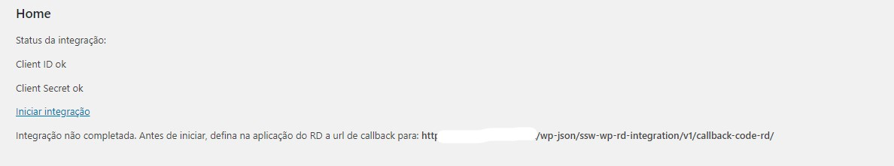
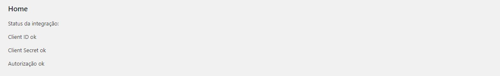

# SSW WP RD Integration
No Desenvolvimento Web estamos constantemente escrevendo sites inteiro, o que garante o uso de um repósitório inteiro de código e portfólio, mas as vezes fazemos apenas algumas seções de um projeto, Seções essas que nos orgulhamos, mas que as vezes não fazemos um repo para cada.

Então neste repositório temos uma integração com o objetivo de prover conexão com o RD para aquisição de dados ou a edição deles
Empacotado como um plugin para WordPress.

## Objetivo
Feito com o objetivo de prover conexão com o RD Station, para programadores que precisam obter/editar no wordpress provê uma classe para isso, após a configuração inicial não precisa se preocupar com authenticação.

## Configurar

### Crie um aplicativo na RD Store
Há um tutorial para a criação de um aplicativo RD na [Documentação do RD](https://ajuda.rdstation.com.br/hc/pt-br/articles/360046742512-Como-publicar-ou-criar-um-aplicativo-no-RD-Station-Marketing). Esse aplicativo até o momento utiliza um app privado, seja livre para modificar segundo a sua necessidade.

- Crie um aplicativo na RD Store na [página da RD Store](https://appstore.rdstation.com/pt-BR) em Integrações >> quero criar um app para uso privado.
- Selecione a conta que o aplicativo acessará.
- Criar app. 
- Preencha os detalhes do app no RD e insira a url de callback que informa na tela desse aplicativo no wordpress. 
- Guarde os dados de Client ID e Client secret do aplicativo do RD. 
- Insira o Client ID e Client secret obtidos do aplicativo do RD e os insira na aba de configurações desse aplicativo no wordpress.
- Na tela inicial desse aplicativo no wordpress inicie a integração. 
- Você será redirecionado ao RD Station para o login e authorização do aplicativo.
- Tela de Integração ok. 

A partir daqui já pode utilizar a classe sem e o aplicativo se encarregará da autenticação.

## Métodos da classe
Veja os [métodos da classe](class-methods.md)

